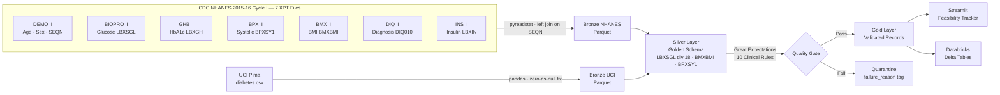

# VITAL-Flow

### Validated Integrated Therapeutic Analytics Lakehouse


---

## Overview

**VITAL-Flow** is a production-grade clinical data engineering project that demonstrates **Medallion Architecture (Bronze → Silver → Gold)** on two real public clinical datasets. The pipeline ingests raw data from CDC NHANES 2015–16 (7 SAS Transport files) and the UCI Pima Indians Diabetes dataset, harmonizes them into a unified **Golden Schema**, validates records against 10 clinical rules using Great Expectations, and serves pipeline health metrics through a Streamlit dashboard.

Designed for Abbott's GDSA hiring evaluation, every design decision reflects industry-standard data engineering practices — schema-on-write enforcement, lineage traceability, clinical bounds validation, and quarantine routing with failure tagging for auditability.

---

## Architecture Diagram



---

## Golden Schema

| Column | Type | Source | Description |
|--------|------|--------|-------------|
| patient_id | String | NHANES: SEQN \| UCI: generated | Unique patient identifier |
| age | Integer | Both | Age in years |
| sex | String | NHANES: RIAGENDR \| UCI: null | M / F / null |
| bmi | Float | NHANES: BMXBMI (BMX_I) \| UCI: BMI | kg/m² |
| glucose_mmol | Float | NHANES: LBXSGL÷18 (BIOPRO_I) \| UCI: Glucose÷18 | Fasting glucose in mmol/L |
| blood_pressure_systolic | Float | NHANES: BPXSY1 (BPX_I) \| UCI: BloodPressure | mmHg |
| hba1c | Float | NHANES: LBXGH (GHB_I) \| UCI: null | HbA1c % |
| insulin_uU_ml | Float | NHANES: LBXIN (INS_I) \| UCI: Insulin | µU/mL — available in both sources |
| diabetes_diagnosed | String | NHANES: DIQ010 (DIQ_I) \| UCI: null | Yes / No / Borderline |
| source_dataset | String | Both | "nhanes" or "uci_pima" |
| ingestion_timestamp | String | Both | ISO 8601 UTC |

---

## How to Run

```bash
# 1. Clone and install
git clone https://github.com/YOUR_USERNAME/vital-flow.git
cd vital-flow
pip install -r requirements.txt

# 2. Download NHANES 2015-16 (cycle I) source files into raw_data/
# https://wwwn.cdc.gov/Nchs/Nhanes/2015-2016/DEMO_I.XPT
# https://wwwn.cdc.gov/Nchs/Nhanes/2015-2016/BIOPRO_I.XPT
# https://wwwn.cdc.gov/Nchs/Nhanes/2015-2016/DIQ_I.XPT
# https://wwwn.cdc.gov/Nchs/Nhanes/2015-2016/GHB_I.XPT
# https://wwwn.cdc.gov/Nchs/Nhanes/2015-2016/BPX_I.XPT
# https://wwwn.cdc.gov/Nchs/Nhanes/2015-2016/BMX_I.XPT
# https://wwwn.cdc.gov/Nchs/Nhanes/2015-2016/INS_I.XPT
# Also place diabetes.csv (UCI Pima) in raw_data/

# 3. Run the pipeline in order
python scripts/ingest_nhanes.py
python scripts/ingest_uci.py
python scripts/harmonize.py
python quality/clinical_validation_suite.py

# 4. Launch the dashboard
streamlit run dashboard/app.py
```

---

## Data Sources

- **NHANES 2015–16 (cycle I):** https://wwwn.cdc.gov/nchs/nhanes/continuousnhanes/default.aspx?BeginYear=2015
- **UCI Pima Indians Diabetes:** https://archive.ics.uci.edu/dataset/34/diabetes

---

## Great Expectations Report

The HTML validation report is generated in `/quality/reports/` after running the Quality Gate.

---

## Loom Walkthrough

`[60-second demo — insert Loom link here]`

---

## Resume Bullets

```
• Architected VITAL-Flow, a production-grade clinical ETL Lakehouse in Databricks,
  automating ingestion and harmonization of 7 CDC NHANES 2015-16 (.XPT) files and the
  UCI Pima Diabetes (.CSV) dataset into a unified Golden Schema using PySpark

• Engineered a Medallion Architecture (Bronze/Silver/Gold) pipeline with schema-on-write
  enforcement, unit normalization (mg/dL → mmol/L), 7-file left-join merge on SEQN,
  and null-handling logic across 6 clinical biomarker columns including a bonus
  diabetes diagnosis label (DIQ010) from the NHANES questionnaire module

• Built a Quality Gate using Great Expectations with 10 clinical validation rules,
  routing failing records to a quarantine layer with failure tagging for auditability

• Developed a Streamlit Feasibility Tracker dashboard monitoring data completeness,
  quarantine rates, and pipeline funnel metrics across multi-source clinical datasets

Tech Stack: Python · PySpark · Great Expectations · Streamlit · Databricks ·
            Delta Lake · Parquet · pandas · pyreadstat
```

---

*VITAL-Flow v1.1 — NHANES 2015–16 cycle I, 7-file merge*
