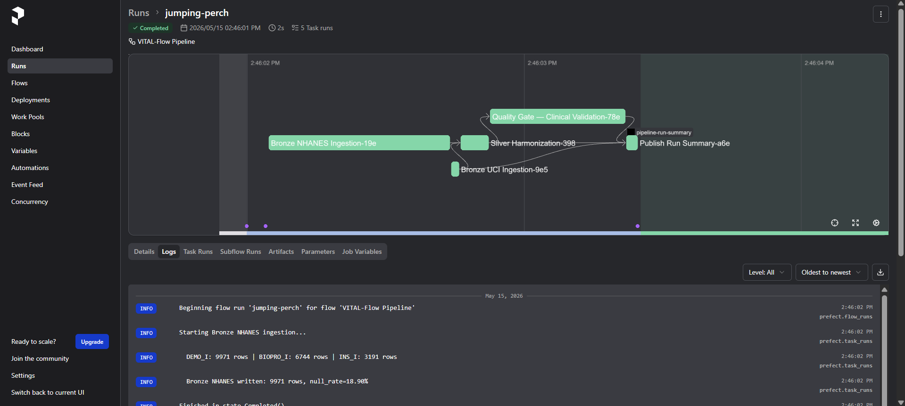
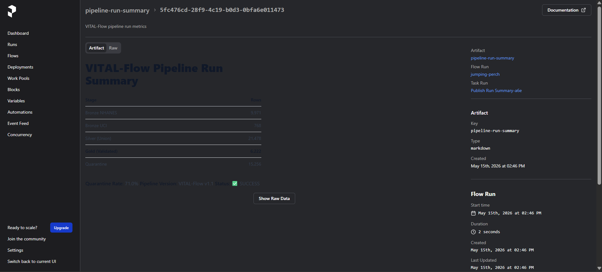
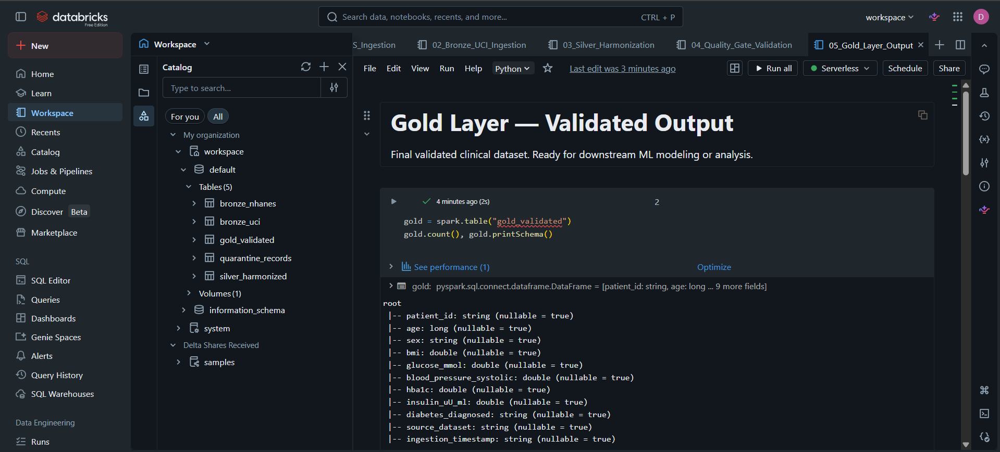
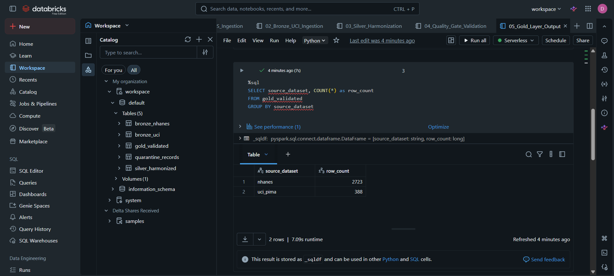

# VITAL-Flow

### Validated Integrated Therapeutic Analytics Lakehouse


---

## Overview

**VITAL-Flow** is a production-grade clinical data engineering pipeline built on the **Medallion Architecture (Bronze → Silver → Gold)**. It ingests raw data from two real public clinical datasets — CDC NHANES 2015-16 (7 SAS Transport `.XPT` files) and the UCI Pima Indians Diabetes dataset — harmonizes them into a unified **Golden Schema**, validates every record against 10 clinical rules using **Great Expectations**, and serves pipeline health metrics through a **Streamlit** dashboard.

The full pipeline is orchestrated with **Prefect**, deployed to **Databricks Serverless**, and backed by **Delta Lake** tables registered in the Databricks Catalog.

---

## Architecture

```
┌─────────────────────────────────────────────┐
│            RAW DATA SOURCES                 │
│  CDC NHANES 2015-16 (7 × .XPT files)       │
│  UCI Pima Indians Diabetes (.CSV)           │
└────────────────────┬────────────────────────┘
                     │  pyreadstat / pandas
                     ▼
┌─────────────────────────────────────────────┐
│              BRONZE LAYER                   │
│  Raw Parquet — exact copy of source data    │
│  NHANES: 9,971 rows  │  UCI: 768 rows       │
└────────────────────┬────────────────────────┘
                     │  Golden Schema mapping
                     │  Unit conversion (mg/dL → mmol/L)
                     ▼
┌─────────────────────────────────────────────┐
│              SILVER LAYER                   │
│  Harmonized Parquet — unified schema        │
│  10,739 rows │ Partitioned by source        │
└────────────────────┬────────────────────────┘
                     │  Great Expectations (10 rules)
                     ▼
          ┌──────────┴──────────┐
          ▼                     ▼
┌──────────────────┐  ┌─────────────────────┐
│   GOLD LAYER     │  │   QUARANTINE LAYER  │
│  3,111 validated │  │  7,628 failed rows  │
│  records         │  │  + failure_reason   │
└──────────────────┘  └─────────────────────┘
          │
          ▼
┌─────────────────────────────────────────────┐
│  Databricks Serverless + Delta Lake         │
│  5 Delta Tables registered in Catalog       │
│  SQL-queryable via Databricks SQL Editor    │
└─────────────────────────────────────────────┘
          │
          ▼
┌─────────────────────────────────────────────┐
│  Streamlit Feasibility Tracker Dashboard    │
│  Prefect Orchestration UI + Run Artifacts   │
└─────────────────────────────────────────────┘
```

---

## Golden Schema

| Column | Type | Source | Description |
|:---|:---|:---|:---|
| `patient_id` | String | NHANES: SEQN · UCI: generated | Unique patient identifier |
| `age` | Integer | Both | Age in years |
| `sex` | String | NHANES: RIAGENDR · UCI: null | M / F / null |
| `bmi` | Float | NHANES: BMXBMI · UCI: BMI | kg/m² |
| `glucose_mmol` | Float | NHANES: LBXSGL÷18 · UCI: Glucose÷18 | Fasting glucose in mmol/L |
| `blood_pressure_systolic` | Float | NHANES: BPXSY1 · UCI: BloodPressure | mmHg |
| `hba1c` | Float | NHANES: LBXGH · UCI: null | HbA1c % |
| `insulin_uU_ml` | Float | NHANES: LBXIN · UCI: Insulin | µU/mL |
| `diabetes_diagnosed` | String | NHANES: DIQ010 · UCI: null | Yes / No / Borderline |
| `source_dataset` | String | Both | `nhanes` or `uci_pima` |
| `ingestion_timestamp` | String | Both | ISO 8601 UTC |

---

## Results

### Prefect Orchestration — Task DAG

The full pipeline runs as a managed Prefect Flow. Bronze NHANES and Bronze UCI tasks execute **in parallel**. Silver waits for both. The Quality Gate waits for Silver. Total runtime: **2 seconds**.



---

### Prefect Run Artifact — Pipeline Summary

After each run, the `Publish Run Summary` task writes a structured Markdown artifact to the Prefect UI showing row counts and quarantine rate.



---

### Databricks — Delta Tables in Catalog + Golden Schema

All 5 Delta tables (`bronze_nhanes`, `bronze_uci`, `silver_harmonized`, `gold_validated`, `quarantine_records`) registered in the Databricks Catalog on Serverless compute. The Golden Schema with all 11 columns is verified in the output.



---

### Databricks — SQL on Gold Layer

Direct SQL query on the `gold_validated` Delta table, grouped by source dataset.

```sql
SELECT source_dataset, COUNT(*) AS row_count
FROM gold_validated
GROUP BY source_dataset
```

| source_dataset | row_count |
|:---|---:|
| nhanes | 2,723 |
| uci_pima | 388 |



---

## Pipeline Metrics

| Stage | Rows |
|:---|---:|
| Bronze NHANES | 9,971 |
| Bronze UCI | 768 |
| Silver (Union) | 10,739 |
| **Gold (Validated)** | **3,111** |
| Quarantine | 7,628 |
| Quarantine Rate | 71.0% |
| GE Expectations Passed | 9 / 9 |
| Pipeline Runtime | 2 seconds |

---

## How to Run

```bash
# 1. Clone and install dependencies
git clone https://github.com/YOUR_USERNAME/vital-flow.git
cd vital-flow
pip install -r requirements.txt

# 2. Place source data in raw_data/
#    NHANES 2015-16: https://wwwn.cdc.gov/nchs/nhanes/continuousnhanes/default.aspx?BeginYear=2015
#    UCI Pima:       https://archive.ics.uci.edu/dataset/34/diabetes

# 3. Run the full pipeline via Prefect
python pipeline/vital_flow_pipeline.py

# 4. Monitor runs in the Prefect UI
prefect server start
# Open: http://localhost:4200

# 5. Launch the Streamlit dashboard
streamlit run dashboard/app.py
```

---

## Project Structure

```
vital-flow/
├── config.yaml                         # Single source of truth — all paths & thresholds
├── requirements.txt
├── README.md
├── scripts/
│   ├── utils.py                        # Shared: load_config, get_spark, get_logger, log_run
│   ├── ingest_nhanes.py                # Bronze: 7-file XPT merge on SEQN
│   ├── ingest_uci.py                   # Bronze: CSV ingestion + zero-as-null correction
│   └── harmonize.py                    # Silver: Golden Schema mapping + union
├── quality/
│   └── clinical_validation_suite.py   # Quality Gate: 10 GE rules, Gold/Quarantine routing
├── pipeline/
│   └── vital_flow_pipeline.py         # Prefect @flow orchestrator with 5 @tasks
├── dashboard/
│   └── app.py                         # Streamlit Feasibility Tracker (5 panels)
├── notebooks/                          # Databricks-ready Jupyter notebooks (5 total)
├── raw_data/                           # gitignored — source XPT + CSV files
├── bronze/                             # gitignored — raw Parquet landing zone
├── silver/harmonized/                  # gitignored — partitioned by source_dataset
├── gold/validated/                     # gitignored — validated Gold Parquet
├── quarantine/failed_records/          # gitignored — failed rows + failure_reason
└── logs/ingestion_log.csv             # gitignored — run metadata log
```

---

## Tech Stack

| Layer | Technology |
|:---|:---|
| Language | Python 3.10+ |
| Data processing | pandas, PyArrow |
| Medical file ingestion | pyreadstat (SAS `.XPT`) |
| Storage format | Apache Parquet |
| Data quality | Great Expectations 0.18 |
| Orchestration | Prefect 3.7 |
| Dashboard | Streamlit + Plotly |
| Cloud platform | Databricks (Serverless) |
| Table format | Delta Lake |
| Configuration | YAML / PyYAML |
| Big data (Databricks) | PySpark 3.5 |

---

## Data Sources

- **CDC NHANES 2015-16:** https://wwwn.cdc.gov/nchs/nhanes/continuousnhanes/default.aspx?BeginYear=2015
- **UCI Pima Indians Diabetes:** https://archive.ics.uci.edu/dataset/34/diabetes

---

## Resume Bullets

```
• Architected VITAL-Flow, a production-grade clinical ETL Lakehouse, automating ingestion
  and harmonization of 7 CDC NHANES 2015-16 (.XPT) files and the UCI Pima Diabetes
  dataset into a unified Golden Schema using pandas and PySpark

• Engineered a Medallion Architecture (Bronze/Silver/Gold) pipeline with schema-on-write
  enforcement, unit normalization (mg/dL → mmol/L), 7-file left-join merge on SEQN,
  and null-handling logic across 6 clinical biomarker columns

• Implemented a Quality Gate using Great Expectations with 10 clinical validation rules,
  routing failing records to a quarantine layer with dynamic failure tagging for auditability

• Orchestrated the full pipeline with Prefect (parallel task execution, auto-retry, run
  artifacts), deployed to Databricks Serverless with 5 Delta tables registered in Catalog

• Built a Streamlit Feasibility Tracker dashboard monitoring biomarker completeness,
  quarantine rates, and pipeline funnel metrics across multi-source clinical datasets

  Tech Stack: Python · pandas · PySpark · Prefect · Great Expectations ·
              Streamlit · Plotly · Databricks · Delta Lake · Parquet
```

---

*VITAL-Flow v1.1 — NHANES 2015-16 cycle I · 7-file merge · Prefect-orchestrated · Databricks-deployed*
