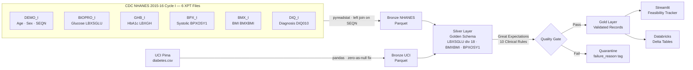

# VITAL-Flow — AI IDE Build Prompt
## Validated Integrated Therapeutic Analytics Lakehouse

> **Instructions for the AI:** You are a senior data engineer. Build the VITAL-Flow project
> end-to-end, exactly as specified below. Follow every implementation note precisely.
> Do not skip steps, do not simplify logic, and do not substitute libraries unless
> explicitly told to. After each phase, confirm what was built and what comes next.

---

## 0. Project Context

You are building **VITAL-Flow**, a production-grade clinical data engineering project
that demonstrates Medallion Architecture (Bronze → Silver → Gold) on two real public
clinical datasets. The pipeline ingests raw data, harmonizes it into a unified Golden
Schema, validates it against clinical rules using Great Expectations, and serves
pipeline health metrics through a Streamlit dashboard.

**Target audience:** Abbott GDSA hiring team. Every design decision must reflect
industry-standard data engineering practice.

**Companion project:** P.U.L.S.E. (ML layer). VITAL-Flow is the data layer only —
no ML modeling in this project.

---

## 1. Initialize the Project

### 1.1 Create Folder Structure

Create the following directory tree from the project root. Create empty `.gitkeep`
files in empty folders so they appear in git.

```
vital-flow/
├── README.md                        ← placeholder, fill in Phase 6
├── requirements.txt
├── config.yaml
├── .gitignore
├── raw_data/                        ← gitignored; user will manually place source files here
├── bronze/
│   ├── nhanes/
│   └── uci/
├── silver/
│   └── harmonized/
├── gold/
│   └── validated/
├── quarantine/
│   └── failed_records/
├── logs/
├── quality/
│   └── reports/
├── scripts/
├── dashboard/
└── notebooks/
```

### 1.2 Create `.gitignore`

```gitignore
# Raw data (large binary files)
raw_data/

# Python
__pycache__/
*.py[cod]
.venv/
*.egg-info/
dist/
.env

# Parquet outputs (regenerated by pipeline)
bronze/
silver/
gold/
quarantine/

# Logs
logs/

# GE internals
quality/great_expectations/uncommitted/

# Jupyter checkpoints
.ipynb_checkpoints/

# OS
.DS_Store
Thumbs.db
```

### 1.3 Create `requirements.txt`

```txt
pyspark==3.5.0
great_expectations==0.18.15
pyreadstat==1.2.6
pandas==2.1.4
streamlit==1.32.0
pyarrow==15.0.0
pyyaml==6.0.1
uuid
plotly==5.20.0
```

### 1.4 Create `config.yaml`

This is the single source of truth for all paths and parameters.
**No script in this project may hardcode any path or threshold — all must read from this file.**

```yaml
paths:
  # NHANES 2015-16 (cycle I) — 6 source files
  # Download all from: https://wwwn.cdc.gov/Nchs/Nhanes/2015-2016/<FILENAME>.XPT
  raw_nhanes_demo:   "raw_data/DEMO_I.XPT"     # Demographics: SEQN, age, sex
  raw_nhanes_biopro: "raw_data/BIOPRO_I.XPT"   # Biochemistry: fasting glucose (LBXSGLU)
  raw_nhanes_diq:    "raw_data/DIQ_I.XPT"      # Diabetes questionnaire: DIQ010 label
  raw_nhanes_ghb:    "raw_data/GHB_I.XPT"      # Glycohemoglobin: HbA1c (LBXGH)
  raw_nhanes_bpx:    "raw_data/BPX_I.XPT"      # Blood pressure: systolic (BPXOSY1)
  raw_nhanes_bmx:    "raw_data/BMX_I.XPT"      # Body measures: BMI (BMXBMI)
  # Optional — download if available:
  raw_nhanes_ins:    "raw_data/INS_I.XPT"      # Insulin: LBXIN
  raw_uci:           "raw_data/diabetes.csv"
  bronze_nhanes:     "bronze/nhanes"
  bronze_uci:        "bronze/uci"
  silver:            "silver/harmonized"
  gold:              "gold/validated"
  quarantine:        "quarantine/failed_records"
  ingestion_log:     "logs/ingestion_log.csv"
  ge_reports:        "quality/reports"

pipeline:
  pipeline_version: "1.1.0"
  nhanes_cycle: "2015-2016"
  nhanes_cycle_suffix: "I"

clinical_bounds:
  age_min: 0
  age_max: 120
  bmi_min: 10.0
  bmi_max: 80.0
  glucose_mmol_min: 1.0
  glucose_mmol_max: 35.0
  bp_systolic_min: 40
  bp_systolic_max: 250
  insulin_min: 0
  insulin_max: 1000
  min_gold_rows: 1000
  min_patient_id_uniqueness: 0.99

uci_impossible_zero_columns:
  - Glucose
  - BloodPressure
  - SkinThickness
  - Insulin
  - BMI
```

### 1.5 Create `scripts/utils.py`

A shared utility module used by all pipeline scripts.

```python
"""
utils.py — Shared utilities for the VITAL-Flow pipeline.
Provides config loading, logging helpers, and a PySpark session factory.
"""

import yaml
import logging
import csv
import os
import uuid
from datetime import datetime, timezone
from pyspark.sql import SparkSession


def load_config(config_path: str = "config.yaml") -> dict:
    """Load the project config.yaml and return as a dict."""
    with open(config_path, "r") as f:
        return yaml.safe_load(f)


def get_spark(app_name: str = "VITALFlow") -> SparkSession:
    """Create or retrieve a SparkSession."""
    return (
        SparkSession.builder
        .appName(app_name)
        .config("spark.sql.shuffle.partitions", "8")
        .getOrCreate()
    )


def get_logger(name: str) -> logging.Logger:
    """Return a configured logger."""
    logging.basicConfig(
        level=logging.INFO,
        format="%(asctime)s [%(levelname)s] %(name)s — %(message)s",
        datefmt="%Y-%m-%dT%H:%M:%S"
    )
    return logging.getLogger(name)


def log_run(
    log_path: str,
    source: str,
    rows_ingested: int,
    null_rate_pct: float,
    status: str
) -> None:
    """
    Append a pipeline run record to the ingestion log CSV.
    Creates the file with headers if it does not exist.
    """
    os.makedirs(os.path.dirname(log_path), exist_ok=True)
    file_exists = os.path.isfile(log_path)
    with open(log_path, "a", newline="") as f:
        writer = csv.DictWriter(f, fieldnames=[
            "run_id", "source", "timestamp",
            "rows_ingested", "null_rate_pct", "status"
        ])
        if not file_exists:
            writer.writeheader()
        writer.writerow({
            "run_id": str(uuid.uuid4()),
            "source": source,
            "timestamp": datetime.now(timezone.utc).isoformat(),
            "rows_ingested": rows_ingested,
            "null_rate_pct": round(null_rate_pct, 4),
            "status": status
        })
```

---

## 2. Phase 1 — Bronze Layer: Raw Ingestion

### 2.1 Create `scripts/ingest_nhanes.py`

```python
"""
ingest_nhanes.py — Bronze layer ingestion for CDC NHANES 2015-16 (cycle I) data.

Reads six .XPT (SAS Transport) files from the 2015-16 NHANES survey cycle,
merges them sequentially on SEQN (the shared respondent sequence number),
and writes the combined raw record to the Bronze Parquet landing zone.

Source files (all cycle I suffix):
  DEMO_I.XPT   — Demographics: SEQN, age (RIDAGEYR), sex (RIAGENDR)
  BIOPRO_I.XPT — Biochemistry panel: fasting glucose (LBXSGLU)
  DIQ_I.XPT    — Diabetes questionnaire: diagnosis label (DIQ010)
  GHB_I.XPT    — Glycohemoglobin: HbA1c (LBXGH)
  BPX_I.XPT    — Blood pressure exam: systolic BP (BPXOSY1)
  BMX_I.XPT    — Body measures: BMI (BMXBMI)

No column renaming, unit conversion, or null-filling is performed at this stage.
All data is preserved exactly as received from the source.
"""
```

**Implement the following logic in this order:**

1. Load `config.yaml` using `load_config()`

2. Load all 6 XPT files into pandas DataFrames using `pyreadstat.read_xport()`:
   - `demo_df`   ← `config["paths"]["raw_nhanes_demo"]`
   - `biopro_df` ← `config["paths"]["raw_nhanes_biopro"]`
   - `diq_df`    ← `config["paths"]["raw_nhanes_diq"]`
   - `ghb_df`    ← `config["paths"]["raw_nhanes_ghb"]`
   - `bpx_df`    ← `config["paths"]["raw_nhanes_bpx"]`
   - `bmx_df`    ← `config["paths"]["raw_nhanes_bmx"]`

3. Before merging, keep only the columns needed from each file to avoid
   column explosion. Retain SEQN plus:
   - `demo_df`:   `["SEQN", "RIDAGEYR", "RIAGENDR"]`
   - `biopro_df`: `["SEQN", "LBXSGLU"]`
   - `diq_df`:    `["SEQN", "DIQ010"]`
   - `ghb_df`:    `["SEQN", "LBXGH"]`
   - `bpx_df`:    `["SEQN", "BPXOSY1"]`
   - `bmx_df`:    `["SEQN", "BMXBMI"]`
   - If any expected column is missing from a file, log a warning and fill
     with NaN rather than raising an error (column availability varies by cycle)

4. Merge all 6 DataFrames sequentially using left joins starting from `demo_df`:
   ```python
   merged = demo_df
   for df in [biopro_df, diq_df, ghb_df, bpx_df, bmx_df]:
       merged = pd.merge(merged, df, on="SEQN", how="left")
   ```
   Use left join (not inner) so that DEMO rows are never dropped — some
   participants may be missing certain exam components.

5. Add column `ingestion_timestamp` = current UTC time as ISO 8601 string

6. Compute `null_rate_pct` = mean of per-column null rates across all columns × 100

7. Write the merged DataFrame to `config["paths"]["bronze_nhanes"]` as Parquet
   using `pyarrow.parquet.write_to_dataset()` with `existing_data_behavior="overwrite_or_ignore"`
   so reruns are idempotent.

8. Call `log_run()` with source=`"nhanes"`, status=`"SUCCESS"` (wrap everything
   in try/except and log `"FAILED"` on any exception, then re-raise)

9. Print the following to stdout on completion:
   - Total rows in merged DataFrame
   - Null rate % per key column: LBXSGLU, LBXGH, BPXOSY1, BMXBMI
   - Count of rows with all 4 key biomarkers present (completeness check)

**Important implementation notes:**
- Use LEFT join from DEMO outward — DEMO is the anchor. Every NHANES participant
  has a DEMO record, but not all attended every exam component.
- Do NOT rename any columns at this stage — raw NHANES names are preserved in Bronze
- Do NOT replace or fill any nulls at this stage
- Column selection in step 3 is mandatory — BIOPRO alone has 25+ columns; keeping
  all would bloat the Bronze file and cause confusion downstream
- Load `ins_df` from `config["paths"]["raw_nhanes_ins"]` and keep `["SEQN", "LBXIN"]`
- Add `ins_df` to the merge loop along with the other 6 files (7 total)
- All paths must be read from `config.yaml`

---

### 2.2 Create `scripts/ingest_uci.py`

```python
"""
ingest_uci.py — Bronze layer ingestion for UCI Pima Indians Diabetes dataset.

Reads the raw CSV, applies minimal preprocessing to correctly represent missing
values (UCI encodes missing as 0 for clinical columns), generates a synthetic
patient_id, and writes to the Bronze Parquet landing zone.

Only missing-value encoding correction is applied at Bronze — no renaming,
no unit conversion, no schema changes.
"""
```

**Implement the following logic in this order:**

1. Load `config.yaml`
2. Read the CSV with `pd.read_csv()`, setting `na_values=["?"]`
3. For each column listed in `config["uci_impossible_zero_columns"]`, replace `0` with `NaN` using `.replace(0, pd.NA)`. Apply only to those columns — not to `Pregnancies` or `Outcome` where 0 is a valid value.
4. Generate a `patient_id` column: `"uci_" + pd.Series(range(len(df))).astype(str).str.zfill(6)`
5. Add column `ingestion_timestamp` = current UTC time as ISO 8601 string
6. Compute `null_rate_pct` as in 2.1
7. Write to `config["paths"]["bronze_uci"]` as Parquet, overwrite mode
8. Call `log_run()` with source=`"uci"`, handle exceptions
9. Print row count and null rate

**Important implementation notes:**
- `Pregnancies` and `Outcome` must NOT have their zeros replaced — zeros are valid there
- The `patient_id` must be generated before writing to Bronze so it appears in the Bronze layer
- Do NOT rename any other columns at this stage

---

## 3. Phase 2 — Silver Layer: Harmonization

### 3.1 Create `scripts/harmonize.py`

```python
"""
harmonize.py — Silver layer harmonization.

Reads Bronze Parquet for both NHANES 2015-16 (cycle I) and UCI, applies column
renaming, unit conversions, and null-fill for missing schema columns, then unions
both into a single harmonized Silver Parquet partitioned by source_dataset.

NHANES column mapping (cycle I specific):
  SEQN      -> patient_id     (unique respondent ID)
  RIDAGEYR  -> age            (age in years)
  RIAGENDR  -> sex            (1=M, 2=F)
  BMXBMI    -> bmi            (from BMX_I)
  LBXSGLU   -> glucose_mmol  (fasting glucose from BIOPRO_I, divided by 18.0)
  BPXOSY1   -> blood_pressure_systolic  (from BPX_I)
  LBXGH     -> hba1c         (from GHB_I)
  LBXIN     -> insulin_uU_ml (from INS_I — confirmed downloaded)
  DIQ010    -> diabetes_diagnosed  (bonus label: 1=Yes, 2=No, 3=Borderline)

This produces the Golden Schema — a unified patient record format that all
downstream validation and modeling will consume.
"""
```

**Golden Schema** — these are the ONLY columns that survive into Silver:

```python
GOLDEN_SCHEMA = [
    "patient_id",               # String
    "age",                      # Integer
    "sex",                      # String ("M", "F", or null)
    "bmi",                      # Float
    "glucose_mmol",             # Float  — converted from mg/dL via ÷ 18.0
    "blood_pressure_systolic",  # Float
    "hba1c",                    # Float (null for UCI)
    "insulin_uU_ml",            # Float — available in both NHANES (INS_I) and UCI
    "diabetes_diagnosed",       # String ("Yes"/"No"/"Borderline"/null) — NHANES only
    "source_dataset",           # String
    "ingestion_timestamp",      # String
]
```

**Implement the following logic:**

**Step 1: Initialize Spark** using `get_spark()` from utils.py

**Step 2: Read Bronze NHANES**
```python
nhanes = spark.read.parquet(config["paths"]["bronze_nhanes"])
```

**Step 3: Apply NHANES transforms using PySpark**

```python
from pyspark.sql import functions as F

# NOTE: LBXSGLU is the fasting glucose column in BIOPRO_I (cycle I).
# This differs from LBXGLU used in some other NHANES cycles. Do NOT
# substitute LBXGLU — it will KeyError on this cycle's Bronze data.

# DIQ010 values: 1=Yes (diabetic), 2=No, 3=Borderline. Map to readable strings.
diq_map = F.when(F.col("DIQ010") == 1, "Yes")             .when(F.col("DIQ010") == 2, "No")             .when(F.col("DIQ010") == 3, "Borderline")             .otherwise(None)

# LBXIN is confirmed present — INS_I.XPT was downloaded and merged at Bronze.

nhanes_silver = nhanes.select(
    F.col("SEQN").cast("string").alias("patient_id"),
    F.col("RIDAGEYR").cast("integer").alias("age"),
    F.when(F.col("RIAGENDR") == 1, "M")
     .when(F.col("RIAGENDR") == 2, "F")
     .otherwise(None).alias("sex"),
    F.col("BMXBMI").cast("float").alias("bmi"),
    (F.col("LBXSGLU").cast("float") / 18.0).alias("glucose_mmol"),   # BIOPRO_I fasting glucose
    F.col("BPXOSY1").cast("float").alias("blood_pressure_systolic"),  # BPX_I
    F.col("LBXGH").cast("float").alias("hba1c"),                      # GHB_I
    F.col("LBXIN").cast("float").alias("insulin_uU_ml"),              # INS_I confirmed
    diq_map.alias("diabetes_diagnosed"),                              # DIQ_I bonus label
    F.lit("nhanes").alias("source_dataset"),
    F.col("ingestion_timestamp"),
)
```

**Step 4: Read Bronze UCI**
```python
uci = spark.read.parquet(config["paths"]["bronze_uci"])
```

**Step 5: Apply UCI transforms using PySpark**

```python
uci_silver = uci.select(
    F.col("patient_id").cast("string"),
    F.col("Age").cast("integer").alias("age"),
    F.lit(None).cast("string").alias("sex"),               # UCI has no sex column
    F.col("BMI").cast("float").alias("bmi"),
    (F.col("Glucose").cast("float") / 18.0).alias("glucose_mmol"),
    F.col("BloodPressure").cast("float").alias("blood_pressure_systolic"),
    F.lit(None).cast("float").alias("hba1c"),              # UCI has no HbA1c column
    F.col("Insulin").cast("float").alias("insulin_uU_ml"),
    F.lit(None).cast("string").alias("diabetes_diagnosed"),# UCI has no diagnosis label
    F.lit("uci_pima").alias("source_dataset"),
    F.col("ingestion_timestamp"),
)
```

**Step 6: Union and write**

```python
silver = nhanes_silver.unionByName(uci_silver)

silver.write.mode("overwrite") \
    .partitionBy("source_dataset") \
    .parquet(config["paths"]["silver"])
```

**Step 7: Log row counts per source**
- Log `"nhanes_silver"` with its row count using `log_run()`
- Log `"uci_silver"` with its row count using `log_run()`
- Log `"silver_union"` with total row count

**Important implementation notes:**
- Both DataFrames must have identical schema (column names AND types) before `unionByName`
- Cast every column to its exact target type explicitly — do not rely on inference
- Null-fill missing schema columns with `F.lit(None).cast(target_type)` rather than omitting them
- Glucose conversion: divide by 18.0 (not 18) to ensure float division

---

## 4. Phase 3 — Quality Gate

### 4.1 Create `quality/clinical_validation_suite.py`

```python
"""
clinical_validation_suite.py — Great Expectations Quality Gate.

Reads the Silver harmonized Parquet, runs a clinical validation suite of 10 rules,
routes passing records to Gold and failing records to Quarantine with a failure_reason tag.

This is the only gate between Silver and Gold. Nothing reaches Gold without passing
all row-level validation rules. Table-level failures halt the pipeline entirely.
"""
```

**Implement the following logic:**

**Step 1: Load Silver into pandas**
```python
import pandas as pd
silver_df = pd.read_parquet(config["paths"]["silver"])
```

**Step 2: Initialize Great Expectations**

```python
import great_expectations as gx

context = gx.get_context()
datasource = context.sources.add_pandas("silver_source")
asset = datasource.add_dataframe_asset("silver_harmonized")
batch_request = asset.build_batch_request(dataframe=silver_df)
```

**Step 3: Define the expectation suite**

Create a suite named `"clinical_validation_suite"` and add ALL of the following expectations:

```python
suite = context.add_expectation_suite("clinical_validation_suite")
validator = context.get_validator(batch_request=batch_request, expectation_suite=suite)

# QG-01: patient_id must never be null
validator.expect_column_values_to_not_be_null("patient_id")

# QG-02: source_dataset must never be null (lineage traceability)
validator.expect_column_values_to_not_be_null("source_dataset")

# QG-03: age must be biologically plausible
validator.expect_column_values_to_be_between(
    "age",
    min_value=config["clinical_bounds"]["age_min"],
    max_value=config["clinical_bounds"]["age_max"]
)

# QG-04: BMI must be clinically plausible
validator.expect_column_values_to_be_between(
    "bmi",
    min_value=config["clinical_bounds"]["bmi_min"],
    max_value=config["clinical_bounds"]["bmi_max"]
)

# QG-05: glucose must be within physiological range (mmol/L)
validator.expect_column_values_to_be_between(
    "glucose_mmol",
    min_value=config["clinical_bounds"]["glucose_mmol_min"],
    max_value=config["clinical_bounds"]["glucose_mmol_max"]
)

# QG-06: systolic blood pressure must be clinically plausible
validator.expect_column_values_to_be_between(
    "blood_pressure_systolic",
    min_value=config["clinical_bounds"]["bp_systolic_min"],
    max_value=config["clinical_bounds"]["bp_systolic_max"]
)

# QG-07: sex must only contain valid encoded values (or null for UCI)
validator.expect_column_values_to_be_in_set(
    "sex", value_set=["M", "F"], mostly=0.5  # UCI rows will be null — don't fail on them
)

# QG-08: insulin must be within physiological range
validator.expect_column_values_to_be_between(
    "insulin_uU_ml",
    min_value=config["clinical_bounds"]["insulin_min"],
    max_value=config["clinical_bounds"]["insulin_max"]
)

# QG-09: patient_id must be nearly unique (table-level)
validator.expect_column_proportion_of_unique_values_to_be_between(
    "patient_id",
    min_value=config["clinical_bounds"]["min_patient_id_uniqueness"],
    max_value=1.0
)

# QG-10: Gold table must not be near-empty (table-level)
validator.expect_table_row_count_to_be_between(
    min_value=config["clinical_bounds"]["min_gold_rows"]
)

validator.save_expectation_suite()
```

**Step 4: Run validation checkpoint**

```python
checkpoint = context.add_or_update_checkpoint(
    name="clinical_checkpoint",
    validator=validator,
)
results = checkpoint.run()
```

**Step 5: Save HTML report**
```python
context.build_data_docs()
# Copy the generated HTML report to config["paths"]["ge_reports"]
```

**Step 6: Row-level routing**

After running the checkpoint, implement manual row-level routing using pandas
(GE validates the suite but does not split rows — you implement the routing):

```python
# For each row-level rule, identify failing rows and tag them
# Use the clinical_bounds from config for all thresholds

failing_masks = {}

failing_masks["patient_id_null"]     = silver_df["patient_id"].isna()
failing_masks["source_dataset_null"] = silver_df["source_dataset"].isna()
failing_masks["age_oob"]             = ~silver_df["age"].between(age_min, age_max)
failing_masks["bmi_oob"]             = ~silver_df["bmi"].between(bmi_min, bmi_max)
failing_masks["glucose_oob"]         = ~silver_df["glucose_mmol"].between(g_min, g_max)
failing_masks["bp_oob"]              = ~silver_df["blood_pressure_systolic"].between(bp_min, bp_max)
failing_masks["insulin_oob"]         = ~silver_df["insulin_uU_ml"].between(ins_min, ins_max)

# A row fails if ANY mask is True for that row
any_fail = pd.concat(failing_masks.values(), axis=1).any(axis=1)

# Build failure_reason string for each failing row (comma-separated rule names)
def build_failure_reason(row_idx):
    reasons = [rule for rule, mask in failing_masks.items() if mask.iloc[row_idx]]
    return ", ".join(reasons)

failing_df = silver_df[any_fail].copy()
failing_df["failure_reason"] = [
    build_failure_reason(i) for i in range(len(silver_df)) if any_fail.iloc[i]
]
passing_df = silver_df[~any_fail].copy()
```

**Step 7: Write Gold and Quarantine**
```python
# Gold
passing_df.to_parquet(config["paths"]["gold"], engine="pyarrow", index=False)

# Quarantine
failing_df.to_parquet(config["paths"]["quarantine"], engine="pyarrow", index=False)
```

**Step 8: Table-level halt logic**
- After writing, check: if `len(passing_df) < config["clinical_bounds"]["min_gold_rows"]`:
  - Log status `"HALTED — Gold table too small"` and raise a `RuntimeError`
- Log Gold and Quarantine row counts to ingestion log

**Important implementation notes:**
- NaN values in numeric columns will evaluate as False in `.between()` — those rows will be routed to quarantine automatically since `~NaN.between(...)` = True. This is correct behavior.
- Do not drop NaN rows before routing — let the bounds check handle them

---

## 5. Phase 4 — Streamlit Dashboard

### 5.1 Create `dashboard/app.py`

```python
"""
app.py — VITAL-Flow Feasibility Tracker Dashboard.

A Streamlit dashboard that monitors pipeline health and data completeness
across the VITAL-Flow Medallion Architecture. Reads from Gold Parquet,
Quarantine Parquet, and the ingestion log CSV.

Run with: streamlit run dashboard/app.py
"""
```

**Implement the following 5 panels in a single Streamlit app:**

#### Panel 1 — Pipeline Funnel
- Read row counts from `logs/ingestion_log.csv`
- Show a Plotly bar chart with stages on x-axis: `Bronze NHANES`, `Bronze UCI`, `Silver`, `Gold`, `Quarantine`
- Color bars: Bronze=`#CD7F32`, Silver=`#C0C0C0`, Gold=`#FFD700`, Quarantine=`#E05252`
- Title: `"Pipeline Funnel — Record Counts by Stage"`

#### Panel 2 — Biomarker Completeness Scorecard
- Read Gold Parquet
- For each of: `glucose_mmol`, `blood_pressure_systolic`, `bmi`, `hba1c`, `insulin_uU_ml`
- Show completeness as `(non-null count / total rows) * 100` — rounded to 1 decimal
- Display as `st.metric()` cards in a 5-column row
- Below the metrics, show a grouped bar chart split by `source_dataset` (NHANES vs UCI)
- Title: `"Biomarker Completeness (Gold Layer)"`

#### Panel 3 — Quarantine Rate by Source
- Read Quarantine Parquet
- Compute quarantine rate per source: `quarantine_count / (gold_count + quarantine_count) * 100`
- Show a Plotly bar chart (one bar per source)
- Below the chart, show a `st.dataframe()` of the top 5 most common `failure_reason` values

#### Panel 4 — Biomarker Distributions
- Read Gold Parquet
- Show two side-by-side Plotly histograms: `glucose_mmol` and `bmi`
- Color by `source_dataset` (use `color` param in Plotly Express)
- Overlay mode (not stacked)
- Title: `"Biomarker Distributions — Gold Layer (by Source)"`

#### Panel 5 — Last Run Metadata
- Read `logs/ingestion_log.csv` and show the most recent row per source
- Display as a `st.table()` with columns: `source`, `timestamp`, `rows_ingested`, `null_rate_pct`, `status`
- Show `pipeline_version` from `config.yaml` as `st.caption()`

**App-level requirements:**
- Page title: `"VITAL-Flow Feasibility Tracker"`
- Page icon: `"🏥"`
- Layout: `wide`
- Add `st.sidebar` with a `"Refresh Data"` button that re-reads all files
- Add a `st.info()` banner at top: `"Data shown reflects the most recent pipeline run. Gold layer only — all records have passed clinical validation."`
- Handle the case where Gold or Quarantine Parquet files don't exist yet: show `st.warning("Pipeline has not been run yet. Execute scripts in order: ingest → harmonize → validate.")` and stop

**Important implementation notes:**
- Use `@st.cache_data` on all data-loading functions with `ttl=60` so the app auto-refreshes
- Do not hardcode any file paths — read from `config.yaml` at app startup
- All Plotly charts must use `use_container_width=True`

---

## 6. Phase 5 — Databricks Notebooks

### 6.1 Convert Scripts to Notebooks

Create the following 5 Jupyter notebooks in `/notebooks/`. Each notebook should:
- Have a markdown cell at the top with the notebook title, description, and inputs/outputs
- Read `config.yaml` using `load_config()` from utils
- Import from `scripts/` using `sys.path.insert(0, "..")`
- Run the equivalent logic from the corresponding script
- End with a markdown cell confirming what was written and the row count

| Notebook filename | Equivalent script | Delta table name |
|---|---|---|
| `01_Bronze_NHANES_Ingestion.ipynb` | `ingest_nhanes.py` | `bronze_nhanes` |
| `02_Bronze_UCI_Ingestion.ipynb` | `ingest_uci.py` | `bronze_uci` |
| `03_Silver_Harmonization.ipynb` | `harmonize.py` | `silver_harmonized` |
| `04_Quality_Gate_Validation.ipynb` | `clinical_validation_suite.py` | — |
| `05_Gold_Layer_Output.ipynb` | reads Gold Parquet | `gold_validated` |

Each notebook must also register its output as a Delta table using Spark SQL:

```python
# Example for Silver notebook
silver = spark.read.parquet(config["paths"]["silver"])
silver.write.format("delta").mode("overwrite").saveAsTable("silver_harmonized")
spark.sql("DESCRIBE TABLE silver_harmonized").show()
```

---

## 7. Phase 6 — README

### 7.1 Create `README.md`

Write a professional README with the following sections in order:

**1. Header**
- Project title: `VITAL-Flow`
- Subtitle: `Validated Integrated Therapeutic Analytics Lakehouse`
- Tech stack badges (use shields.io): Python, PySpark, Great Expectations, Streamlit, Databricks, Delta Lake, Parquet

**2. Overview (3–4 sentences)**
What it is, what problem it solves, and why it matters for clinical analytics.

**3. Architecture Diagram**
Render this Mermaid diagram:



**4. Golden Schema Table**

| Column | Type | Source | Description |
|--------|------|--------|-------------|
| patient_id | String | NHANES: SEQN \| UCI: generated | Unique patient identifier |
| age | Integer | Both | Age in years |
| sex | String | NHANES: RIAGENDR \| UCI: null | M / F / null |
| bmi | Float | NHANES: BMXBMI (BMX_I) \| UCI: BMI | kg/m² |
| glucose_mmol | Float | NHANES: LBXSGLU÷18 (BIOPRO_I) \| UCI: Glucose÷18 | Fasting glucose in mmol/L |
| blood_pressure_systolic | Float | NHANES: BPXOSY1 (BPX_I) \| UCI: BloodPressure | mmHg |
| hba1c | Float | NHANES: LBXGH (GHB_I) \| UCI: null | HbA1c % |
| insulin_uU_ml | Float | NHANES: LBXIN (INS_I) \| UCI: Insulin | µU/mL — available in both sources |
| diabetes_diagnosed | String | NHANES: DIQ010 (DIQ_I) \| UCI: null | Yes / No / Borderline |
| source_dataset | String | Both | "nhanes" or "uci_pima" |
| ingestion_timestamp | String | Both | ISO 8601 UTC |

**5. How to Run**

```bash
# 1. Clone and install
git clone https://github.com/YOUR_USERNAME/vital-flow.git
cd vital-flow
pip install -r requirements.txt

# 2. Download NHANES 2015-16 (cycle I) source files into raw_data/
# https://wwwn.cdc.gov/Nchs/Nhanes/2015-2016/DEMO_I.XPT
# https://wwwn.cdc.gov/Nchs/Nhanes/2015-2016/BIOPRO_I.XPT
# https://wwwn.cdc.gov/Nchs/Nhanes/2015-2016/DIQ_I.XPT
# https://wwwn.cdc.gov/Nchs/Nhanes/2015-2016/GHB_I.XPT
# https://wwwn.cdc.gov/Nchs/Nhanes/2015-2016/BPX_I.XPT
# https://wwwn.cdc.gov/Nchs/Nhanes/2015-2016/BMX_I.XPT
# https://wwwn.cdc.gov/Nchs/Nhanes/2015-2016/INS_I.XPT
# Also place diabetes.csv (UCI Pima) in raw_data/

# 3. Run the pipeline in order
python scripts/ingest_nhanes.py
python scripts/ingest_uci.py
python scripts/harmonize.py
python quality/clinical_validation_suite.py

# 4. Launch the dashboard
streamlit run dashboard/app.py
```

**6. Data Sources**
- NHANES 2015–16 (cycle I): https://wwwn.cdc.gov/nchs/nhanes/continuousnhanes/default.aspx?BeginYear=2015
- UCI Pima Indians Diabetes: https://archive.ics.uci.edu/dataset/34/diabetes

**7. Great Expectations Report**
Link to the HTML report committed in `/quality/reports/`

**8. Loom Walkthrough**
Placeholder: `[60-second demo — insert Loom link here]`

---

## 8. Final Verification Checklist

After building all phases, verify each of the following. Fix any that fail before considering the project complete.

### Code
- [ ] All 7 NHANES XPT files present in `raw_data/` (DEMO_I, BIOPRO_I, DIQ_I, GHB_I, BPX_I, BMX_I, INS_I)
- [ ] `python scripts/ingest_nhanes.py` completes without error and writes Bronze Parquet
- [ ] Bronze NHANES Parquet contains columns: `SEQN`, `RIDAGEYR`, `RIAGENDR`, `LBXSGLU`, `LBXGH`, `BPXOSY1`, `BMXBMI`, `DIQ010`
- [ ] `python scripts/ingest_uci.py` completes without error and writes Bronze Parquet
- [ ] `python scripts/harmonize.py` completes without error and writes Silver Parquet
- [ ] Silver Parquet contains `diabetes_diagnosed` column (non-null for NHANES rows)
- [ ] Silver Parquet `glucose_mmol` values are all < 30 (confirms ÷18 conversion happened)
- [ ] `python quality/clinical_validation_suite.py` completes and writes Gold + Quarantine Parquet
- [ ] `logs/ingestion_log.csv` has entries from all 4 scripts
- [ ] Gold row count > 1000; Quarantine row count > 0

### Dashboard
- [ ] `streamlit run dashboard/app.py` opens without error
- [ ] All 5 panels render with real data
- [ ] Panel 3 shows at least one quarantined record with a `failure_reason`
- [ ] Sidebar refresh button re-reads data

### Quality
- [ ] GE HTML report exists in `quality/reports/`
- [ ] Report shows 10 expectations, at least 8 passing
- [ ] Quarantine Parquet has a `failure_reason` column

### Repository
- [ ] `raw_data/` is in `.gitignore` and not committed
- [ ] All 5 notebooks exist in `/notebooks/`
- [ ] README renders correctly on GitHub with Mermaid diagram
- [ ] `config.yaml` is the only place where paths and thresholds are defined

---

## 9. Common Errors & Fixes

| Error | Likely Cause | Fix |
|-------|-------------|-----|
| `KeyError: 'LBXSGLU'` in harmonize.py | BIOPRO_I not merged into Bronze, or wrong cycle | Confirm `BIOPRO_I.XPT` is in `raw_data/` and was loaded in `ingest_nhanes.py`. Cycle I uses `LBXSGLU` for fasting glucose — not `LBXGLU`. |
| `KeyError: 'LBXGLU'` in harmonize.py | Old prompt version still using LAB_J column names | Replace `LBXGLU` with `LBXSGLU` everywhere in harmonize.py — this is the correct column for BIOPRO_I cycle I. |
| `KeyError: 'BPXOSY1'` in harmonize.py | BPX_I.XPT not downloaded or not merged | Download `BPX_I.XPT` from NHANES 2015-16, add to `raw_data/`, re-run `ingest_nhanes.py`. |
| `KeyError: 'BMXBMI'` in harmonize.py | BMX_I.XPT not downloaded or not merged | Download `BMX_I.XPT` from NHANES 2015-16, add to `raw_data/`, re-run `ingest_nhanes.py`. |
| `AnalysisException: unionByName` | Schema mismatch between NHANES and UCI Silver | Ensure both have identical column lists and types before union; add explicit casts |
| `ModuleNotFoundError: pyreadstat` | Not installed or wrong venv | `pip install pyreadstat==1.2.6` in your active environment |
| GE checkpoint fails immediately | GE Data Context not initialized | Run `great_expectations init` in project root first, or use the `gx.get_context()` API which auto-inits |
| Gold Parquet is empty | All rows failed QG-07 sex check | QG-07 uses `mostly=0.5` — UCI rows have null sex which is expected. Verify the `mostly` parameter is set. |
| Streamlit shows "Pipeline has not been run" | Gold Parquet doesn't exist | Run all 4 scripts in order before launching the dashboard |
| `java.lang.OutOfMemoryError` in PySpark | Too many shuffle partitions | `config("spark.sql.shuffle.partitions", "4")` in get_spark() |

---

## 10. Resume Bullets (Copy When Complete)

```
• Architected VITAL-Flow, a production-grade clinical ETL Lakehouse in Databricks,
  automating ingestion and harmonization of 7 CDC NHANES 2015-16 (.XPT) files and the
  UCI Pima Diabetes (.CSV) dataset into a unified Golden Schema using PySpark

• Engineered a Medallion Architecture (Bronze/Silver/Gold) pipeline with schema-on-write
  enforcement, unit normalization (mg/dL → mmol/L), 6-file left-join merge on SEQN,
  and null-handling logic across 6 clinical biomarker columns including a bonus
  diabetes diagnosis label (DIQ010) from the NHANES questionnaire module

• Built a Quality Gate using Great Expectations with 10 clinical validation rules,
  routing failing records to a quarantine layer with failure tagging for auditability

• Developed a Streamlit Feasibility Tracker dashboard monitoring data completeness,
  quarantine rates, and pipeline funnel metrics across multi-source clinical datasets

Tech Stack: Python · PySpark · Great Expectations · Streamlit · Databricks ·
            Delta Lake · Parquet · pandas · pyreadstat
```

---

*VITAL-Flow IDE Build Prompt — v1.1 (updated for NHANES 2015–16 cycle I, 6-file merge)*  
*Paste this entire document into Cursor / Windsurf and say: "Build this project phase by phase, starting with Phase 1."*
